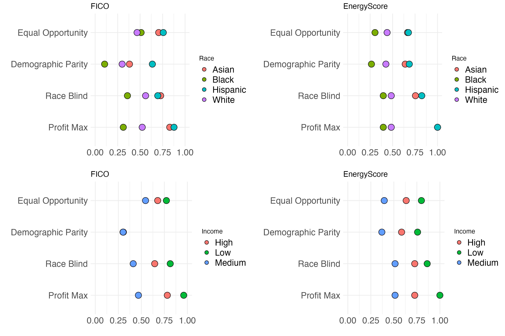

# Fairness in Focus Repo

This repo accompanies the whitepaper, Fairness in Focus: Quantitative Insights into Bias within Machine Learning Risk Evaluations and Established Credit Models. 

## Objectives
This research aims to achieve two objectives:

1. To conduct a case study to assess the level of bias using traditional fairness criteria.
2. To conduct a novel analysis by extending the number of protected classes considered.

## Results
The results of this study provide a quantitative comparison of the degree of discrimination faced by different protected classes in this specific use case. The findings show that the machine learning model results in lower degrees of variance in various thresholds for most considered protected classes.

